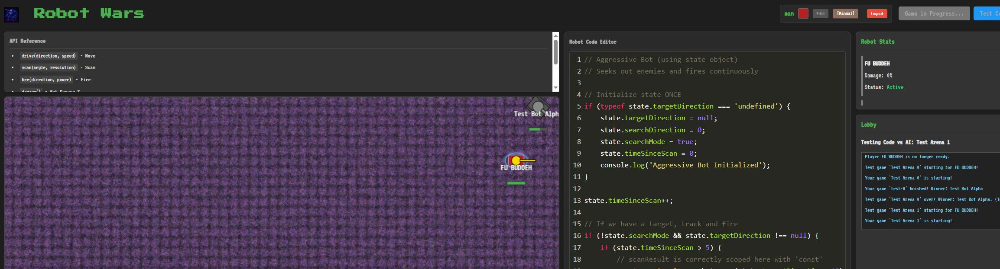

# 🤖 ROBOT WARS 🤖

A modern, web-based reincarnation of the classic CROBOTS game where you battle with JavaScript instead of bullets.

**[🔥 PLAY NOW ON GITHUB PAGES 🔥](https://bneidlinger.github.io/RobotWars)**



## Overview

Robot Wars is a programming game where players write JavaScript code to control robot avatars in a virtual arena. Your code controls your robot's movement, scanning, and weapons as it battles other player-controlled robots in real-time.

## Robot Wars Programming Guide

Learn how to program your combat robot with our comprehensive guide! From basic movement to advanced tactical strategies, this resource will help you dominate in the arena.

[](https://bneidlinger.github.io/RobotWars/BotProgrammingGuide.html)
[](https://robotwars-c198.onrender.com)
[](https://github.com/bneidlinger/RobotWars)

## Features

- 🎮 In-browser JavaScript coding environment with code save/load functionality
- 🔄 Real-time multiplayer battles with spectator mode
- 🎭 Multiple robot appearance options (Default, Tank, Spike, Tri)
- 📊 Live battle statistics and damage tracking
- 💬 In-game chat system for players and spectators
- 📜 Game history tracking
- 🎮 Robot console output for debugging
- 🌐 WebSocket-based communication
- 🛡️ Secure sandboxed code execution
- 📱 Responsive design for desktop and mobile

## Getting Started

1. Clone the repository:
```bash
git clone https://github.com/bneidlinger/RobotWars.git
cd RobotWars
```

2. Install dependencies:
```bash
npm install
```

3. Start the server:
```bash
npm start
```

4. Open your browser to `http://localhost:3000`

Alternatively, you can access the latest version directly at:
- GitHub Pages: https://bneidlinger.github.io/RobotWars
- Render Deployment: https://robotwars-c198.onrender.com

## How to Play

1. **Write Your Robot AI**: Use the in-browser code editor to program your robot's behavior
2. **Enter Your Name**: Add your player name to be displayed in the arena
3. **Choose Appearance**: Select from different robot designs
4. **Ready Up**: Click "Ready Up" to join the matchmaking queue
5. **Battle**: When enough players are ready, a match begins automatically
6. **Spectate**: Watch ongoing matches when you join during active games
7. **Chat**: Communicate with other players using the in-game chat
8. **Save Loadouts**: Save your best code for future matches

## Robot API

Your code can use these methods to control your robot:

```javascript
robot.drive(direction, speed); // Move in a direction (0-359 degrees) at speed (-5 to 5)
robot.scan(direction, resolution); // Scan for enemies in an arc
robot.fire(direction, power); // Fire a missile (power 1-3)
robot.damage(); // Get current damage level (0-100)
robot.getX(); // Get current X coordinate
robot.getY(); // Get current Y coordinate
robot.getDirection(); // Get current direction (degrees)
```

State is preserved between ticks with the `state` object:

```javascript
// Initialize state variables
if (typeof state.counter === 'undefined') {
    state.counter = 0;
    state.lastDirection = 0;
}
// Use and modify state
state.counter++;
```

## Console Output

Your robot can log messages to the dedicated Robot Console using:

```javascript
console.log("Enemy detected at distance: " + scanResult.distance);
```

## Project Structure

```
/robot-wars/
├── client/           # Frontend assets and code
│   ├── assets/       # Images and resources
│   ├── css/          # Styling
│   ├── js/           # Client-side logic
│   │   ├── engine/   # Game engine components
│   │   └── ui/       # User interface components
│   └── index.html    # Main HTML file
└── server/           # Backend Node.js code
    ├── game-*.js     # Game logic
    ├── server-*.js   # Server-side components
    └── index.js      # Entry point
```

## Technologies

- **Frontend**: HTML5 Canvas, JavaScript, Socket.IO client, CodeMirror editor
- **Backend**: Node.js, Express, Socket.IO
- **Code Execution**: Node.js VM for sandboxed evaluation
- **Networking**: Real-time WebSocket communication

## Licensing

Robot Wars is available under a dual licensing model:

### Open Source License (MIT)

The Robot Wars codebase is licensed under the MIT License for **personal, non-commercial, and open source use**. This allows you to:

- Use and modify the code for personal projects
- Contribute improvements back to the main repository
- Learn from and experiment with the codebase

See the [LICENSE](LICENSE) file for full details.

### Commercial and Educational Licensing

For **commercial use, educational institutions, coding bootcamps, or organized learning environments**, please contact us for licensing options. We offer:

- Classroom licensing packages
- Custom deployment options
- Technical support

For inquiries about commercial or educational licensing, please contact: [brandon.neidlinger@gmail.com](mailto:brandon.neidlinger@gmail.com)

## Inspirations

This project is inspired by the original [CROBOTS](https://github.com/tpoindex/crobots) game, where players programmed virtual robots in a simplified C language.

## Links

- [Play Now on GitHub Pages](https://bneidlinger.github.io/RobotWars)
- [Play on Render](https://robotwars-c198.onrender.com) (Always up-to-date with latest features)
- [GitHub Repository](https://github.com/bneidlinger/RobotWars)
- [Leave Feedback](https://github.com/bneidlinger/RobotWars/issues)

---

*"In the arena of code, only the clever survive."*